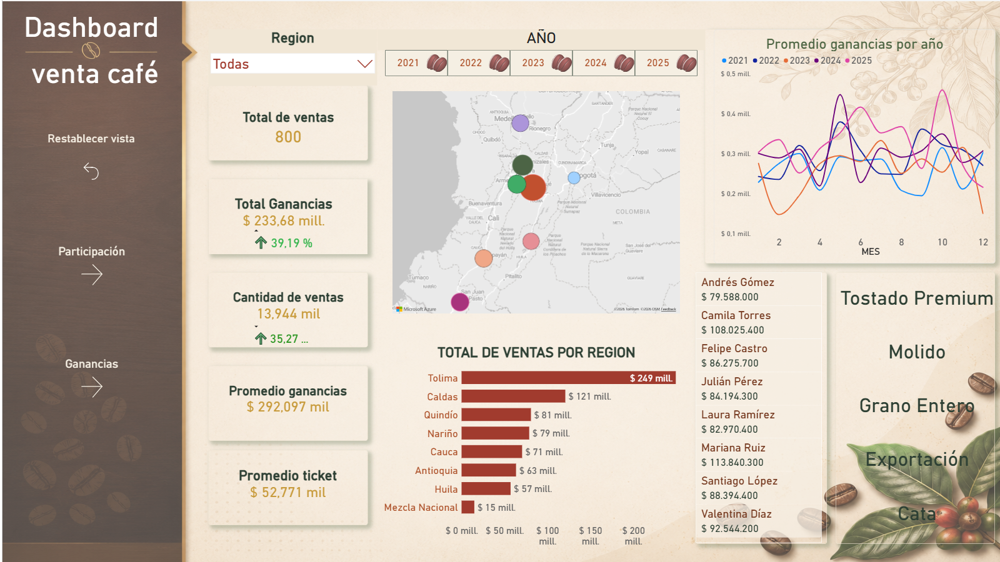
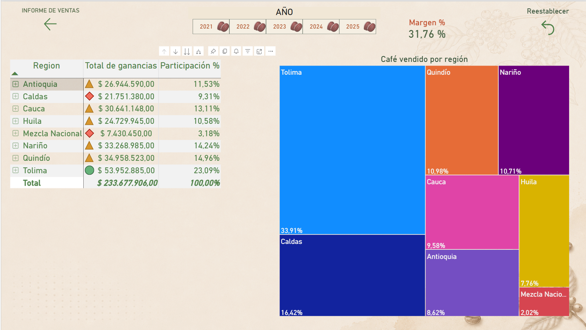
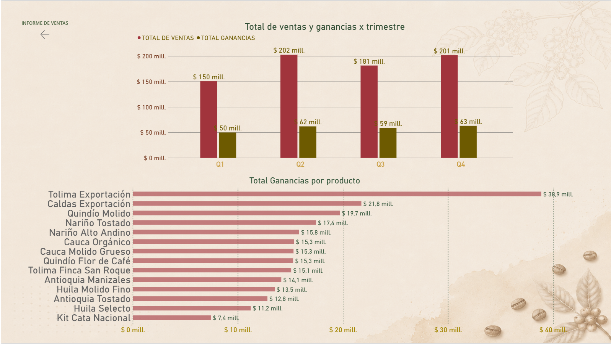

# ☕ Coffee Dashboard - Café de Especialidad Colombiano S.A.S.

Dashboard de análisis de ventas para una empresa de café especial colombiano. Proyecto de portafolio en Power BI con dataset sintético de 800 registros (2021-2025).

## 🔗 Demo en vivo
👉 [Ver dashboard interactivo](https://camiloriveral.github.io/coffee-dashboard-colombia/)

## 📸 Vista previa

## 🛠️ Stack técnico
- **Power BI**: modelado de datos (esquema estrella), DAX, visualizaciones
- **DAX**: CALCULATE, DATEADD, TOTALYTD, USERELATIONSHIP
- **Python (openpyxl)**: generación del dataset sintético
- **Power Query**: transformación y limpieza de datos

## 📊 Dataset
- 800 registros | 14 productos | 7 regiones colombianas | 8 vendedores | 4 canales de venta
- Período: 2021-2025

## 📈 Características del dashboard
- Análisis YoY% con formato de pesos colombianos
- Mapa de burbujas por departamento
- Formato condicional con iconos

